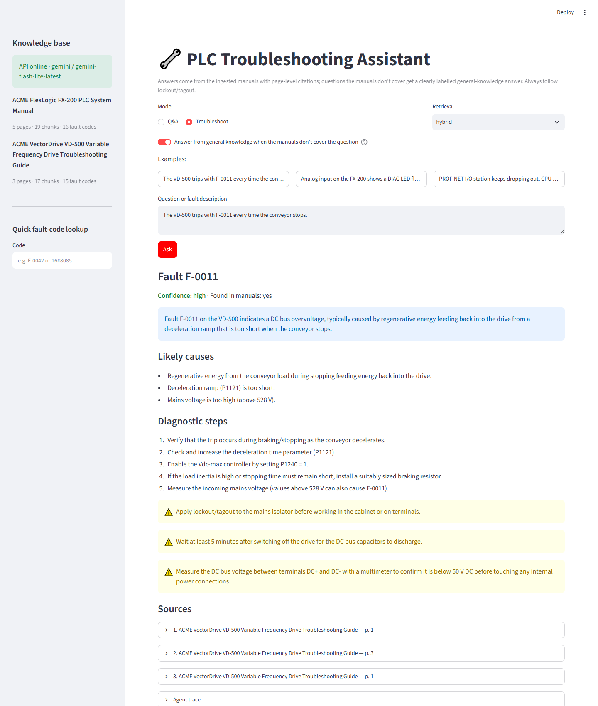
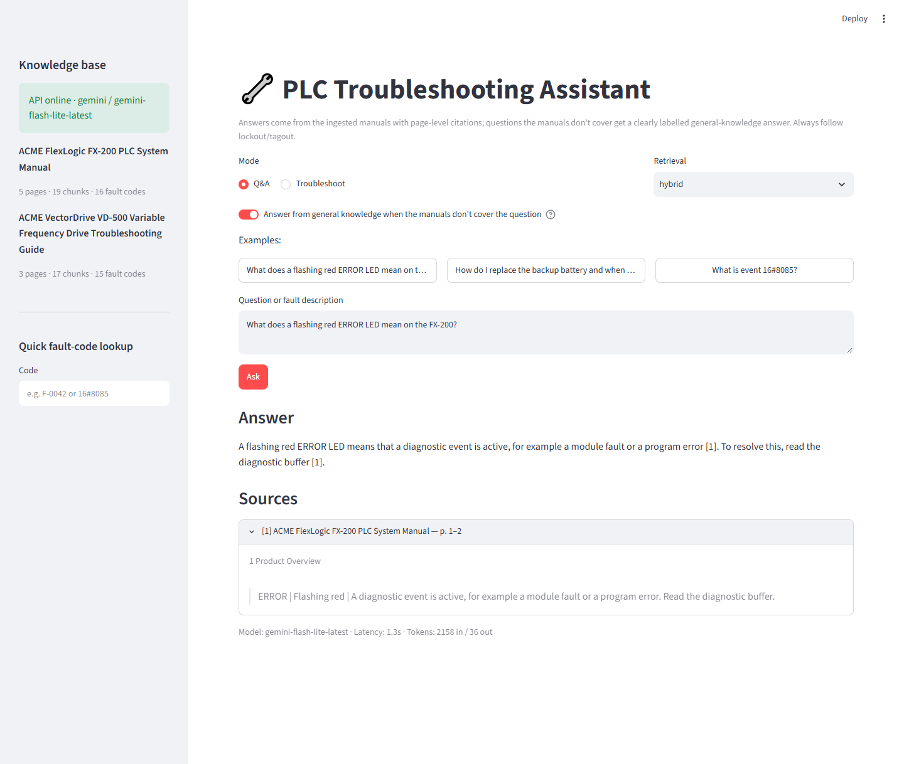
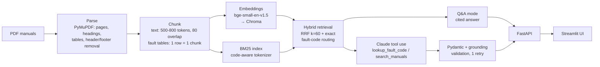

# PLC Troubleshooting Assistant

**Ask a PLC or drive manual a question in plain English, or paste a fault code, and get a cited answer or a validated, step-by-step troubleshooting plan in seconds.**

**Troubleshoot mode**: a fault code becomes a validated plan with causes, ordered steps, safety notes and page citations.



<details>
<summary><b>Q&A mode</b>: answer with [n] citations and the source snippet (click to expand)</summary>



</details>

*Screenshots from the Streamlit UI running on the two fictional demo manuals with Gemini Flash-Lite.*

---

## Why

A maintenance engineer facing a stopped line usually has a fault code on an HMI and a stack of 300-800 page PDF manuals. Finding the right table row, the matching procedure and the safety notes means jumping between the CPU manual, the module manual and the drive manual while the line is down.

Before my Master of Information Technology at the University of Auckland, I worked in network operations at China Mobile, where incident handling followed the same pattern: alarm code first, then a hunt through vendor documentation for the meaning and the fix. This project automates that lookup for factory automation. It retrieves the exact manual passages, answers only from them with page-level citations, and returns troubleshooting plans as machine-readable JSON that a CMMS, HMI or ticketing system could consume.

## What it does

| Capability | How |
|---|---|
| **Q&A with citations** | Hybrid retrieval → Claude answers *only* from the retrieved excerpts, citing every statement as `[n]` (document + page). Says *"Not found in the provided manuals"* instead of guessing. |
| **General answers, clearly labelled** | When the manuals don't cover a question, the grounded verdict stays "not found", and a separate general-knowledge answer is added (in the user's language) and shown as *not verified against your documentation*. It can be switched off per request with `allow_general`. |
| **Troubleshoot mode** | A tool-calling agent (`lookup_fault_code`, `search_manuals`) researches the fault, then submits a plan validated against a Pydantic schema: causes, ordered steps, safety notes, citations, confidence. |
| **Exact fault-code lookup** | Every row of a fault-code table becomes its own chunk, so `16#8085`, `F-0042` or `E-101` resolve to one precise table entry. Also available as `GET /fault-codes/{code}` without any LLM call. |
| **Evaluation** | A 29-question labelled set; Hit@k, MRR, LLM-as-judge, citation accuracy and refusal accuracy for `vector` vs `bm25` vs `hybrid` retrieval. |
| **API + UI** | FastAPI (`/ask`, `/fault-codes/{code}`, `/documents`, `/health`) and a single-page Streamlit demo. |

## Architecture



| Layer | Implementation |
|---|---|
| Parsing | `app/ingest/pdf_parser.py`: 1-based pages, repeated header/footer lines removed (>50% of pages), hyphenated line breaks re-joined, heading detection by font size/weight, tables via `page.find_tables()` |
| Chunking | `app/ingest/chunker.py`: heading-aware packing, overlap only within a section, one chunk per fault-code row with `chunk_type="fault_code"` and a normalised `fault_code` |
| Retrieval | `app/retrieval/`: Chroma (cosine) + `rank_bm25`, Reciprocal Rank Fusion, configurable `vector` / `bm25` / `hybrid` |
| Generation | `app/generation/`: provider-neutral LLM interface. **Claude** (`anthropic` SDK, default `claude-sonnet-5-5`), Google **Gemini** and **OpenRouter** as alternatives, an optional automatic fallback provider, and an offline `FakeLLM` for tests |
| Serving | `app/api/main.py` (FastAPI), `ui/streamlit_app.py` |
| Quality | `tests/` (pytest, fully offline), `eval/` (metrics + LLM-as-judge) |

## Key design decisions

**Hybrid retrieval, because fault codes are exact strings.** Dense embeddings capture meaning ("the drive stops when braking" ≈ "DC bus overvoltage") but blur identifiers: `16#8085` and `16#8086` look almost identical to an embedding model. BM25 matches them exactly. Its tokenizer keeps `16#8085` / `e-101` intact and also indexes `e101`, so any notation the engineer types still matches. RRF merges both rankings without score calibration, and when the query contains a code that exists in a fault table, that row is pinned to rank 1.

**One chunk per fault-code row.** A fault table split into 800-token windows mixes ten codes per chunk. The model then sees neighbouring rows and can attach the wrong remedy. A one-row chunk (`code + description + cause + remedy`, with the table heading as context) is self-contained, gives exact citations, and makes `lookup_fault_code` a dictionary lookup instead of a search.

**Schema validation and a retry, because downstream systems need reliable JSON.** The troubleshoot result is submitted through a tool whose input schema *is* the Pydantic model. Validation is two-stage:
1. Pydantic types and rules: `confidence` is an enum, ordered steps are required when `found_in_manuals=true`.
2. A grounding check: every citation must point to a document page that one of the agent's tool calls actually returned.

A failure is sent back to the model once as an error tool result. A second failure returns a structured error (`ok=false`, raw output attached) instead of crashing or passing unverified data on.

**Refusal is a feature, but a dead end isn't.** Both grounded prompts instruct the model to answer *"Not found in the provided manuals"* when the excerpts don't cover the question. The eval set includes unanswerable questions specifically to measure this. Users still want help with general questions (e.g. "how do I tune a PID loop?"), so a second, separate call answers from general knowledge. It is kept in its own `general_answer` field, never mixed with cited content, and labelled in the UI. The evaluation runs with it disabled, so refusal accuracy measures the grounded pipeline only.

**Offline by default in tests.** All 89 tests use a generated synthetic PDF, a deterministic hashing embedder and `FakeLLM`. `pytest` needs no network and no API key.

## Evaluation results

Full report: [eval/results/20261005-075907.md](eval/results/20261005-075907.md) (raw records in the matching `.json`).

**Setup.** 29 questions over the two demo manuals:

| Type | Questions |
|---|---|
| Fault-code | 9 |
| Procedure | 7 |
| Concept | 8 |
| Unanswerable | 5 |

Index: 36 chunks, 31 of them fault-code rows. Embeddings: `BAAI/bge-small-en-v1.5`. Answers and judging: Gemini `gemini-flash-lite-latest` (free tier, Google AI Studio API), top-6 chunks. The same pipeline runs on Claude; this run used Gemini because it was the key available. The question set was drafted with AI assistance and is still flagged `needs_review`.

**Retrieval (24 answerable questions)**

| Mode | Hit@1 | Hit@3 | Hit@5 | MRR | Fault-code Hit@1 | Procedure Hit@1 |
|---|---|---|---|---|---|---|
| vector | 0.67 | 0.83 | 0.92 | 0.76 | 0.78 | 0.57 |
| bm25 | **0.88** | **1.00** | 1.00 | **0.94** | 0.89 | **0.86** |
| hybrid | 0.83 | 0.96 | 1.00 | 0.89 | **1.00** | 0.57 |

**Answers (all 29 questions)**

| Mode | LLM judge (1-5) | Citation accuracy | Refusal accuracy (unanswerable) | False refusals (answerable) | Median latency |
|---|---|---|---|---|---|
| vector | 4.59 | 0.83 | 1.00 | 0.08 (2/24) | 1.4 s |
| bm25 | 4.83 | **0.94** | 1.00 | 0.00 | 1.2 s |
| hybrid | **4.90** | 0.87 | 1.00 | 0.00 | 1.3 s |

Mean latencies (4.8–10.0 s) are dominated by free-tier rate-limit back-off (22 retried 429/503 responses), so the medians are the fair comparison.

**Findings**

- **Exact codes need keyword matching.** Dense retrieval alone ranked the right fault-code entry first for only 78% of fault-code questions. With BM25 and exact-code routing, hybrid reached 100% Hit@1 and MRR 1.00 on that slice.
- **Hybrid gave the best answers, but BM25 was the strongest retriever on this corpus.** The demo manuals are short and keyword-dense, and every question uses the manual's own terms. RRF let the weaker vector ranking pull procedure questions down (Hit@1 0.57 vs 0.86 for BM25). On real manuals with paraphrased questions this balance may shift. The next experiment is a weighted RRF or a cross-encoder re-ranker, measured on a reviewed question set.
- **No hallucinated answers to unanswerable questions.** All 5 were refused in every mode. Vector-only retrieval caused 2 false refusals (the relevant chunk was not retrieved), and neither BM25 nor hybrid had any.

Caveats: the judge is the same model as the answerer (possible self-preference), 29 questions is a small sample (one question ≈ 4 percentage points), and the manuals are synthetic.

## Quick start

Requirements: Python 3.11+ and [uv](https://docs.astral.sh/uv/) (or `python -m venv` + `pip install -e .`).

```bash
uv sync
cp .env.example .env        # then set ANTHROPIC_API_KEY (or GEMINI_API_KEY + LLM_PROVIDER=gemini)
```

**1. Add manuals.** Put PDF manuals into `data/raw/`. This folder is gitignored because vendor manuals are copyrighted. Suggested public documents:

- Siemens *SIMATIC S7-1200 System Manual* (diagnostics and LED chapters): Siemens Industry Online Support
- Rockwell Automation *Micro800 / CompactLogix* user or troubleshooting manuals (fault-code tables): Rockwell Literature Library
- Any VFD manual with a fault-code chapter (e.g. ABB ACS580, Siemens SINAMICS G120)

To try the project without downloading anything, generate two fictional manuals ("ACME" PLC + VFD) that the evaluation set was written against:

```bash
uv run python -m scripts.generate_demo_manuals
```

**2. Build the index.**

```bash
uv run python -m app.ingest --rebuild
```

The first run downloads the embedding model (~130 MB). The command prints documents, pages, chunks and fault-code chunks. Re-running without `--rebuild` is a no-op when nothing changed.

**3. Run it.**

```bash
uv run uvicorn app.api.main:app --port 8000          # API, docs at http://127.0.0.1:8000/docs
uv run streamlit run ui/streamlit_app.py             # UI at http://localhost:8501
```

Command-line tools:

```bash
uv run python -m app.retrieval "16#8085" --mode bm25
uv run python -m app.generation "The VD-500 trips with F-0011 when the conveyor stops" --mode troubleshoot
uv run python -m eval.run --retrieval all                  # full eval (uses the LLM)
uv run python -m eval.run --retrieval all --no-generation  # retrieval metrics only, free
uv run pytest
```

Example API call:

```bash
curl -X POST http://127.0.0.1:8000/ask -H "Content-Type: application/json" -d "{\"question\": \"What does event 16#8085 mean?\", \"mode\": \"qa\", \"retrieval\": \"hybrid\"}"
```

## Configuration

All settings live in `.env` (see [.env.example](.env.example)). The main ones:

| Variable | Default | Purpose |
|---|---|---|
| `LLM_PROVIDER` | `anthropic` | `anthropic`, `gemini`, `openrouter` or `fake` (offline) |
| `ANTHROPIC_MODEL` | `claude-sonnet-5-5` | Claude model for answers and tool use |
| `GEMINI_MODEL` / `OPENROUTER_MODEL` | `gemini-flash-latest` / `thinkingmachines/inkling:free` | alternative providers |
| `LLM_FALLBACK_PROVIDER` | *(empty)* | provider to try when a primary call fails |
| `EMBEDDING_MODEL` | `BAAI/bge-small-en-v1.5` | local sentence-transformers model |
| `CHUNK_MIN_TOKENS` / `CHUNK_MAX_TOKENS` / `CHUNK_OVERLAP_TOKENS` | 500 / 800 / 80 | chunking |
| `RETRIEVAL_MODE` / `TOP_K` | `hybrid` / 6 | retrieval defaults |

## Project layout

```
app/
  config.py            settings (pydantic-settings)
  fault_codes.py       fault-code patterns + normalisation
  ingest/              pdf_parser.py, chunker.py, pipeline.py, __main__.py (CLI)
  retrieval/           vector.py (Chroma), bm25.py, hybrid.py (RRF), store.py, embeddings.py
  generation/          llm.py (Claude/Gemini/OpenRouter/Fake), prompts.py, qa.py, troubleshoot.py, tools.py, general.py
  api/                 main.py, schemas.py
ui/streamlit_app.py
eval/                  dataset.jsonl, run.py, metrics.py, judge_prompt.md, results/
scripts/               PDF generator for demo manuals and the test fixture
tests/                 offline pytest suite (synthetic PDF + FakeLLM)
```

## Limitations & next steps

- **Scanned PDFs need OCR.** Text is extracted from the PDF text layer. Older scanned manuals would need an OCR step (e.g. Tesseract via PyMuPDF's OCR support) before chunking.
- **Table extraction depends on ruled tables.** Fault tables without grid lines, or split across pages without a repeated header, can be missed. A layout model or vendor-specific parsers would make this more robust.
- **The evaluation set is small and was drafted against fictional demo manuals.** The 29 questions were drafted with AI assistance and are flagged `needs_review` until checked by hand. Numbers on real vendor manuals (S7-1200, Micro800) will differ. The next step is a reviewed set of ~100 questions per manual family.
- **Document sources.** Factories keep manuals and work instructions in SharePoint / Microsoft 365. A Microsoft Graph connector with incremental re-ingestion (the pipeline is already idempotent via file fingerprints) would replace the local `data/raw/` folder.
- **Live alarm context.** The natural next integration is the PLC itself: read active alarms over OPC UA or from the historian/SCADA, then pre-fill the troubleshoot request with the fault code, the module slot and recent events.
- **Feedback loop.** Let technicians mark steps as "fixed it" or "not relevant". Those labels become new evaluation data and a signal for re-ranking.
- **Access control and audit.** No authentication or multi-tenancy (out of scope for a demo). A production deployment would need both, plus logging of which document version an answer was based on.
